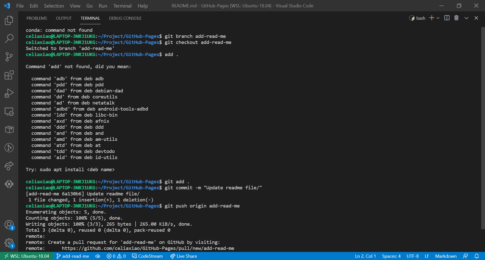

# Heading


**This is bold text**

In the words of Abraham Lincoln:

> Quoting text

Quoting code
```
git status
git add
git commit
```

External [links](https://pages.github.com/).

## Section [link](https://pages.github.com/)

relative [link](README.md)

- George Washington
- John Adams
- Thomas Jefferson

1. James Madison
2. James Monroe
3. John Quincy Adams

Task list
- [x] task1
- [ ] task2
- [ ] task3